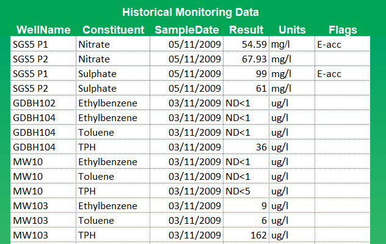
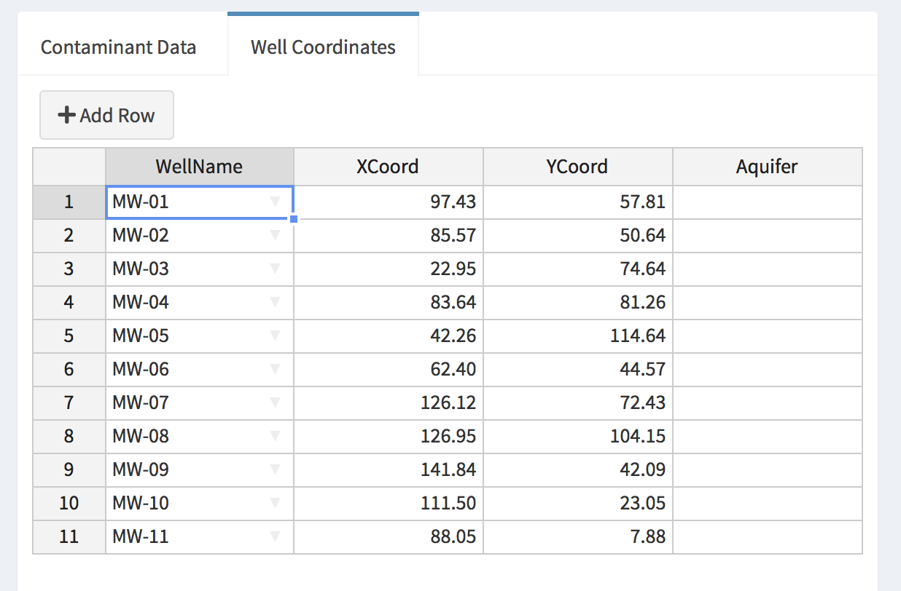

# Input Data Format {#DataInput}
There are a few different ways to enter user data into GWSDAT and the available choices will depend upon the way the user is accessing GWSDAT. However, no matter, which way you are [`Accessing GWSDAT`](#AccessingGWSDAT) the formatting standard and conventions of the raw data input tables are identical. Hence, this section is dedicated to describing the standardised data table input structure and formatting conventions. Later sections will discuss the data input details with respect to the mode of access. See Section \@ref(DataInputExcelAddin) for data input via Excel Add-in and Section \@ref(DataInputviaGUI) for data input directly via the Graphical User Interface. 
 
There are only two input tables that must be completed, namely, the *Historical Monitoring Data* table and the *Well Coordinates* table. Please note that there should be no empty rows in either table. Optionally, users can also specify links to the location of GIS shapefiles for use as basemaps or site plans.

<!-- THe user can optionally specify an associated additionally -->
<!-- The third *GIS Shapefiles* table may be populated with links to the location of GIS shapefiles for use as basemaps or site plans, if required.  -->
<!-- Please ensure that there are no empty rows in these completed data input tables.  -->
<!-- Two example data sets are provided with the software for training purposes, the use of which is explained in section \ref{GettingStarted}. -->


## Historical Monitoring Data Input Table {#HistoricalMonitoringDataInputTable}

Each row of this table corresponds to a unique combination of well, sampling date and solute type. Groundwater and NAPL (Non-Aqueous Phase Liquids) gauging data may also be entered in this table. Figure \ref{fig:EgHistMonitoringData} displays an example GWSDAT input data set for
illustrative purposes. The columns (fields) in the *Historical Monitoring Data* input table are as follows: 

```{r, fig.cap = "Example Historical Monitoring table", label="EgHistMonitoringData"}

```

* **WellName**: the name or identifier of the well (or soil boring) from which the sample was collected. Well names must be consistent and unique. For example, 'MW-1' and 'MW1' will be treated as different wells.

* **Constituent**: Here enter the name of the solute type, e.g. Benzene, Toluene. Again in the same manner as WellName please ensure that the name of a solute is consistent and unique for all entries.  The identifiers 'GW' and 'NAPL' are reserved for Groundwater elevation measurements 
and NAPL thickness data respectively, see further details below.

* **SampleDate**: the date at which the well was sampled (not the date the results were returned from laboratory analysis). 
Please use a calendar date format, the preferred format is 'dd/mm/yyyy'. Do not include a time of day. 

* **Result**: the value of the measurement made. This will be a solute concentration, a groundwater level or a NAPL thickness, as specified in the *Constituent* column.

  + **Solute Concentrations**:
The concentration of the constituent is entered here. Non-detect values should be entered as either '<X' or 'ND<X', where 'X' is the detection limit specified by the laboratory. For example, if the detection limit is 100ug/l then either '<100' or 'ND<100' is acceptable. The non-detect threshold value must be specified so 'ND' on its own is not permissible. In the absence of known detection limits, a sensible value must be substituted.  This could be the lowest measured value for the solute in the dataset.   

  + **Groundwater** 
level data is entered as an elevation above a common datum, such as metres or feet above sea level or some other common reference height. All groundwater measurement entries should have the same units, such as metres or feet, and the 'Constituent' field should be set to 'GW'. In the presence of NAPL, please ensure that the groundwater level has been corrected for NAPL density.

  + **NAPL** thickness data is also entered here. Please ensure that all NAPL thickness entries 
have the same units, e.g. feet or metres and that the Constituent field is set to 'NAPL'. 
If no NAPL is present, do not add a NAPL entry with zero thickness; simply omit from the table. Where NAPL is recorded in soil borings that do not reach the water table the NAPL thickness should be entered as zero.  Well location markers for soil borings or wells where NAPL has been recorded are highlighted in red.

* **Units**:  Solute concentration data can either be 'mg/l' or 'ug/l'. For groundwater elevation and NAPL thickness data please set to one of 'mm', 'cm', 'metres', 'inches', 'feet' or 'level'. Units must be specified for each entry. All 
entered groundwater elevation measurements must have the same units. Likewise for NAPL thickness.

* **Flags**:  Four different flags are available to modify the way in which certain types of data are handled by the software. 
The 'E-Acc' (Electron Acceptor), 'NotInNAPL' and 'Redox' flags are used to identify input data types 
which are to be omitted in the event that the user activates the NAPL substitution function (see Section \ref{NAPLHandlingMethod}). 
Note, that it is only necessary to flag one data row in this way for all rows containing that constituent to be excluded from NAPL substitution. The fourth flag ('Omit') can be used to exclude individual data entry rows from the GWSDAT analysis. 
  


## Well Coordinates Table {#WellCoordinatesTable}

The *Well Coordinates* table, see Figure \@ref(fig:EgWellCoordsTable), is used to store the coordinates of groundwater monitoring wells or soil borings. For most of the purposes of GWSDAT modelling, it is only the relative distances between wells which are important. This means any arbitrary cartesian coordinate system can be used as long as well coordinate values have an aspect ratio very close to 1, i.e. a unit in the x-coordinate is the same distance as a unit in the y-coordinate. Hence, well coordinates can be measured directly from a map, or given in easting and northing, etc. 

```{r, fig.cap = "Example Well Coordinates table.", label="EgWellCoordsTable", echo = FALSE}

```


* **WellName**: the name or identifier of the well or soil boring. Well names must be identical to those specified in the *Historical Monitoring Data* table. On a point of detail, it is better to name wells using the convention of 'MW-01' rather than 'MW1' so that plots in GWSDAT are correctly ordered. 

* **XCoord**: the x-coordinate of the well.

* **YCoord**: the y-coordinate of the well.

* **Aquifer**: The (optional) aquifer field allows the user to associate wells or soil borings with particular subsurface features (e.g. aquifers, sub-strata), in the event that data from these needs to be modelled separately. The user can enter the name (maximum of 8 characters) of the aquifer or sub-stratum, or select a letter A-G from the drop-down listbox. The aquifer field can also be used to partition the dataset from a large site, in the event that multiple unrelated plumes are present or if wells are clustered with large gaps in between. On initiation of a GWSDAT analysis the user is asked to select an aquifer (subsurface feature) to analyse. **Note**: Plots generated using data associated with particular subsurface features have the feature name appended to the title, e.g. Shallow aquifer. If the user leaves the aquifer flag as blank, no such appending will occur. 

* **CoordUnits**:
Either leave this field blank or select 'metres' or 'feet'. The units specified in this field are used in the calculation of plume mass balance parameters (e.g. plume area and solute mass), for further details see Section \@ref(GWSDATPlumeDiagnostics) on plume diagnostics.


## GIS ShapeFiles {#GISShapeFiles}

A site plan can be superposed over plots of concentration distribution, NAPL
thickness and groundwater elevation (see example in Figure \ref{fig:GWSDATSpatialPlot}). Site plans are imported
into GWSDAT in the form of shapefiles (see `http://en.wikipedia.org/wiki/Shapefile` for more information). A shapefile is actually a collection of several files, typically created using ARC-GIS. See Section \@ref(ConvShapRosie) for more details on how to generate a shapefile from a CAD drawing using ARC-GIS.

If using the GWSDAT Excel Add-in interface (Section \@ref(DataInputExcelAddinMenu)) then only the location of the main shapefile (file ending with a '.shp' extension) needs to be specified in the GIS Shapefile table, see Figure \@ref(fig:EgGISShapeFilesTable).  The associated
data files (e.g. .dbf, .sbn, .sbx, .shx) will be picked up automatically,provided they are in the same folder (see example in Figure \ref{fig:GWSDATExcelAddinmenu}).It is possible to overlay multiple shapefiles up to a maximum of seven.

Alternatively, if using the GWSDAT Graphical User Interface interface (Section \@ref(DataInputviaGUI)) to input data then all the associated shapefiles (e.g. .shp, .dbf, .sbn, .sbx, .shx) need to be selected and uploaded. 

```{r, fig.cap = "Example GIS ShapeFiles table.", label="EgGISShapeFilesTable", echo = FALSE}

```

<!-- A further possible component of the data is a site map in the form of a *shape file*.  This is optional but can be very useful in superimposing map information on spatial plots.  Examples will be given later in the manual. -->
<!-- \fbox{The paragraphs below need to be updated.} -->
<!-- A 'shapefile' is actually a collection of several files, typically created using ARC-GIS.^[See `http://en.wikipedia.org/wiki/Shapefile` for more information on this format.]  The *Shape Files* table consists of a single column where each entry is the name of a file (including its path) containing site plans.  These must be in shapefile format. Filenames can be entered manually or, in interactive mode, the `Browse ...' can be used. Only the location of the main shapefile (file ending with a `.shp' extension) needs to be specified in this table - the associated data files (such as `.dbf`, `.sbn`, `.sbx`, `.shx`) will be picked up automatically, but they must be in the same folder. An example is given in the Figure below.  -->
<!-- It is possible to overlay multiple shapefiles up to a maximum of seven.  There should be no empty rows in the table. -->
<!-- ## Entering your own data -->
<!-- The various ways in which data can be entered are described below.  The easiest option is likely to be to create the spreadsheets in a format you are familiar with, such as *Excel*, and then load the files into GWSDAT. -->


<!-- # GWSDAT Excel Add-in {#DataInputExcelAddin} -->

<!-- ## Add-in Menu {#DataInputExcelAddinMenu} -->

<!-- ```{r, fig.cap = "GWSDAT Excel Add-in menu and example data file.", label="GWSDATExcelAddinmenu",out.width = '100%', echo = FALSE} -->
<!-- include_graphics("figures/GWSDAT_Add-in_Menu.png") -->
<!-- ``` -->

<!-- Please see the section [`Excel Add-in Interface`](#ExcelDataEntryInterface) for details on how to install the GWSDAT Excel Add-in. The menu options, as shown in Figure \ref{fig:GWSDATExcelAddinmenu}, are as follows: -->

<!-- * **New GWSDAT Sheet**: Inserts a blank GWSDAT data input template worksheet into the active Excel workbook.  -->

<!-- * **Insert Shapefile**: Interactively browse for a shapefile and add location to GIS Shapefiles table, see Section \@ref(GISShapeFiles) for more information. -->

<!-- * **Analyse**: Begin GWSDAT analysis on the Excel active worksheet data. -->

<!-- * **Restore Session**: Load a previously saved GWSDAT session, see Section ?? for more information. -->

<!-- * **Open Example -$>$ Simple Example**: Inserts an example GWSDAT worksheet data set into the active Excel workbook. -->

<!-- * **Open Example -$>$ Comprehensive Example**: Inserts a more detailed example GWSDAT worksheet data set which includes a site plan, NAPL thickness data, 'Electron Acceptor' flagged solutes and multiple aquifers into the active Excel workbook. -->

<!-- * **User Manual**: Opens the online GWSDAT user manual via user's web browser. You must be connected to the internet for this to work.  -->

<!-- * **About GWSDAT**: Displays version information and Terms & Conditions for GWSDAT. -->

<!-- * **Update GWSDAT**: Check if a newer version of the underlying GWSDAT R package exists at `https://cran.r-project.org/package=GWSDAT`. If a more recent version is detetced then it will be automatically installed. You must be connected to the internet for this to work.   -->


<!-- ## Add-in Data Processing Options {#ExcelAddinMenuDataProcessingOptions} -->

<!-- ```{r, fig.cap = "GWSDAT Excel Add-in Processing Options", label="ExcelAddinProcessingOptions", echo = FALSE} -->
<!--     include_graphics("figures/ExcelAddinProcessingOptions.png") -->
<!-- ``` -->
<!-- On initiation of a GWSDAT analysis via the Excel Add-in, data processing options are displayed, as shown in Figure \ref{fig:ExcelAddinProcessingOptions}. The data processing options influence how the data is displayed and how non-detects are handled. -->


<!-- * **Model Output Interval**: -->
<!-- The spatiotemporal model can generate predictions at a user specified interval. The three different options are as follows: -->

<!--   + **Day**: Concentration and groundwater elevation contour plots are generated for every date represented in the input dataset. This is a good option to choose if each monitoring event comprises samples/ measurements collected within one 24-hour period.  -->

<!--   + **Month**: Concentration and groundwater elevation contours are generated at monthly intervals, working backwards  -->
<!-- in time from the latest date in the input dataset. Choosing this option aggregates groundwater elevation data within each  -->
<!-- monthly interval so that a larger dataset is available for the plotting of elevation contours (by local linear regression).  -->

<!--   + **Quarter**: Concentration and groundwater elevation contours are generated at quarterly (3 month) intervals, working backwards in time from the latest date in the input dataset. Choosing this option aggregates groundwater elevation data within each 3-month interval so that a larger dataset is available for the plotting of elevation contours (by local linear regression).  -->

<!--   Note that both the monthly and quarterly model output options only aggregate the dataset used to plot groundwater elevation contours. The solute concentration dataset is not aggregated in time because the spatiotemporal model from which concentration contours are generated does not require this, i.e. the underlying spatiotemporal model used to generate the solute concentration smoother plots does not vary with the data aggregation interval. -->

<!--   Note that if no monitoring data is present within a particular monthly or quarterly interval, then GWSDAT will not generate a groundwater elevation contour or spatio-temporal solute concentration smoother plot. This is to avoid producing potentially misleading spatial plots far away in time from any actual data. -->

<!-- * **GW Level Aggregation Method**: In the event that there are multiple groundwater elevation measurements from the same well within a given output interval, the user can select how to use this data. The user can select to calculate either the 'Mean', 'Median', -->
<!-- 'Min', or 'Max' groundwater elevation. Again, this choice does not affect the spatiotemporal model used to generate the solute concentration smoother plots. -->

<!-- * **Non-Detect Handling Method**: GWSDAT handles non-detect data by a method of substitution. In accordance with general convention, the default option is to substitute the non-detect data with half its detection limit, e.g. ND<50ug/l is substituted with 25ug/l. For a more conservative choice, select the alternative of non-detect data to be substituted with its full detection limit, e.g. ND<50ug/l is substituted with 50ug/l.  -->

<!-- * **Model Resolution**: This option controls the resolution of the spatiotemporal solute concentration smoother (see Appendix \@ref(SSCS)). The user can select between either a default resolution or a higher resolution model fit. In most instances there will be little difference in the modelling results between the two settings. However, in some rare circumstances with complex data sets, it may well be necessary to use the higher resolution setting. Please note it takes approximately 3-4 times longer to fit a higher resolution model.  -->


<!-- ## NAPL Handling Method {#NAPLHandlingMethod} -->
<!-- An additional pop-up box will be displayed after the GWSDAT options box if the input contains NAPL data (i.e. 'NAPL' is entered in the constituent field). Selecting 'Yes' to the question 'Do you wish to substitute NAPL values with maximum observed solute concentrations?' forces GWSDAT to recognise NAPL data in the input dataset as indicative of high dissolved solute concentrations. This option has been added to provide the user with a more realistic picture of the area of impacted groundwater in the event that NAPL in wells prevents direct measurement of CoC concentrations. *Before using this function the user should, however, be confident that dissolved solutes are derived from the observed NAPL and not from a different source*. Solutes flagged as 'Electron Acceptors' (see Section \@ref(HistoricalMonitoringDataInputTable)) are omitted from the NAPL substitution process. -->

