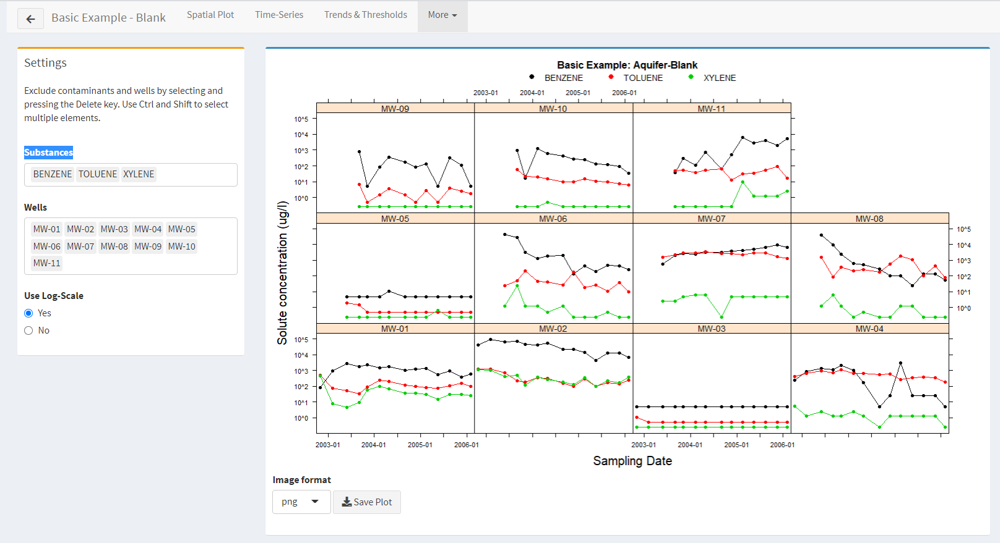
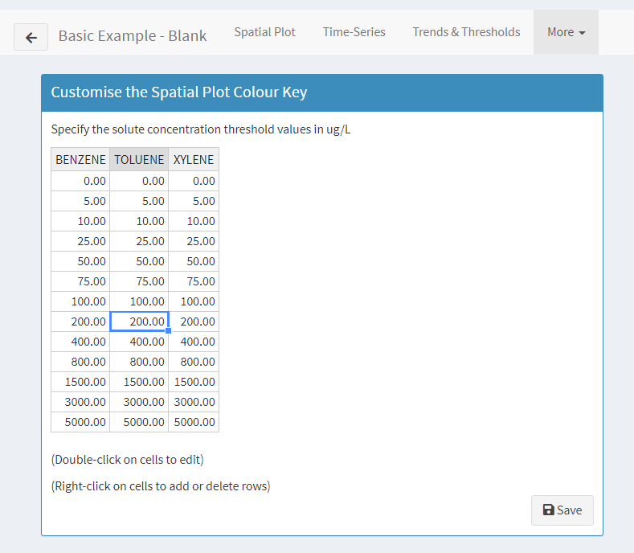

# GWSDAT Graphical User Interface (GUI) {#GWSDATGUI}

The GWSDAT user interface is a web-based graphical user interface (GUI) which the user can interact with in many ways. The following sections will explain the interface in more detail.


## Data Input via Graphical User Interface {#DataInputviaGUI}

GWSDAT comes supplied with examples of groundwater monitoring data and these can be used to experiment with the tools for analysis and visualisation.  If you would like to do this you can move immediately to Section~X of this manual.  However, the aim of GWSDAT is of course to provide means of analysing user-supplied data and various options are supplied to allow this.  These options are all available from the *Manage Data* page which is the point of entry when GWSDAT is launched but can also be accessed at any time from the *Manage Data* item on the menu bar on the left hand side of the window.


```{r echo = FALSE}
    include_graphics("figures/data_manager.png", auto_pdf = FALSE)
```


A *Basic Example* and a *Comprehensive Example* are supplied but the buttons at the top of the page allow other data to be entered, in different forms.

```{r echo = FALSE}
tbl <- matrix(c("Restore Examples", "This allows the two in-built examples to be restored at any point, should this be needed.",
                "Load Data", "Use the *Browse* button to	loaded from a previous GWSDAT session.",
                "Add New Data", "This allows data to be entered manually into a spreadsheet (and saved for later use).",
                "Import .csv Data", "Use the *Browse* buttons to load separate 'Contaminant Data' and 'Well Coordinates' files, each in `.csv` form.  One or more shapefiles may also be loaded.",
                "Import Excel File", "Use the *Browse* button to load an Excel spreadsheet containing both 'Contaminant Data' and 'Well Coordinates'. One or more shapefiles may also be loaded."
                ), ncol = 2, byrow = TRUE)
kable(tbl) %>%
  column_spec(2, width = "30em")
```


```{r echo = FALSE}
tbl <- matrix(c("Import Excel File", "The file to be loaded should contain two spreadsheets labelled `Contaminant Data` and `Well Coordinates` and have the structure described above.  An example spreadsheet is available at *web address at gwsdat.net*.",
              "Import .csv Data", "The data can be exported from *Excel() into `.csv` format.  In this case there should be separate `.csv` files for the *Contaminant Data* and *Well Coordinates*.  Click on the *Browse* button to select these files.  For convenience, GWSDAT gives options for the *Column separator* and the *Quote for Character Strings* at the foot of this page. Click on the *Import|* button to read the data.",
              "Add New Data", "This creates blank spreadsheets with the required structure.  Entries can by typed in directly or copied and pasted from another source.  There is an *+Add Row* button and right clicking gives further options for adding and removing rows.",
              "Load Data", "This allows data which has previously been saved from GWSDAT to be loaded again."
              ), ncol = 2, byrow = TRUE)
kable(tbl) %>%
  column_spec(2, width = "30em")
```


<!-- \begin{tabular}{rm{0.7\textwidth}} -->
<!-- \cline{2-2} -->
<!-- \colorbox{NavyBlue}{\color{white} \textsf{Restore Examples}} & -->
<!-- This allows the two in-built examples to be restored at any point, should this be needed.  \\ -->
<!-- \cline{2-2} -->
<!-- \colorbox{NavyBlue}{\color{white} \textsf{Load Data}} & -->
<!-- Use the \textit{Browse} button to	loaded from a previous GWSDAT session. \\ -->
<!-- \cline{2-2} -->
<!-- \colorbox{NavyBlue}{\color{white} \textsf{Add New Data}} & -->
<!-- This allows data to be entered manually into a spreadsheet (and saved for later use).  \\ -->
<!-- \cline{2-2} -->
<!-- \colorbox{NavyBlue}{\color{white} \textsf{Import .csv Data}} & -->
<!-- Use the \textit{Browse} buttons to load separate 'Contaminant Data' and 'Well Coordinates' files, each in \texttt{.csv} form.  One or more shapefiles may also be loaded. \\ -->
<!-- \cline{2-2} -->
<!-- \colorbox{NavyBlue}{\color{white} \textsf{Import Excel File}} & -->
<!-- Use the \textit{Browse} button to load an Excel spreadsheet containing both 'Contaminant Data' and 'Well Coordinates. One or more shapefiles may also be loaded. \\ -->
<!-- \cline{2-2} -->
<!-- \end{tabular} -->

The details of data entry are described below but it is helpful first to describe the format of the data which is required.  The essential information is in are two spreadsheets - one which contains the contaminant data, and a second one which gives the co-ordinates of the wells.  There is also an option to use shape files to superimpose map information on spatial plots.

An example of the first spreadsheet is shown for the *Basic Example* in the screenshot below.  The full spreadsheet can be viewed by clicking the *Edit* button for the *Basic Example* in the *Manage Data* page of GWSDAT.  (When you wish to return to the *Manage Data* page, click the `back-arrow' button in the top left hand corner of the *Edit Data* page.)  The columns of the spreadsheet are explained in detail below.

\fbox{Wayne advises against the use of the term 'contaminant' but this is the terminology used in the software.}

<!-- \colorbox{NavyBlue}{\color{white} \textsf{Import Excel File}}  The file to be loaded should contain two spreadsheets labelled `Contaminant Data' and `Well Coordinates' and have the structure described above.  An example spreadsheet is available at \fbox{web address at gwsdat.net}. -->

<!-- \ -->

<!-- \noindent -->
<!-- \colorbox{NavyBlue}{\color{white} \textsf{Import .csv Data}}   The data can be exported from Excel into \texttt{.csv} format.  In this case there should be separate \texttt{.csv} files for the Contaminant Data and Well Coordinates.  Click on the `Browse' buttons to select these files.  For convenience, GWSDAT gives options for the `Column separator' and the `Quote for Character Strings' at the foot of this page. Click on the `Import' button to lead the data. -->

<!-- \ -->

<!-- \noindent -->
<!-- \colorbox{NavyBlue}{\color{white} \textsf{Add New Data}}  This creates blank spreadsheets with the required structure.  Entries can by typed in directly or copied and pasted from another source.  There is an \textit{+Add Row} button and right clicking gives further options for adding and removing rows. -->

<!-- \ -->

<!-- \noindent -->
<!-- \colorbox{NavyBlue}{\color{white} \textsf{Load Data}}  \fbox{Is this option available - I can't see a Save option?} -->


GWSDAT is designed to produce informative visualisations of groundwater monitoring over space and time.  To illustrate this, we will use the *Basic Example*.  If you are still in the detailed pages of the *Manage Data* section, click on the `back-arrow' in the top left hand corner to return to the main \textit{manage Data} page and then click on *Analyse* on the left had sidebar.  You will then be asked to specify which dataset you would like to analyse.  In addition to the standard examples, any other datasets you have created will be listed here too.  For the moment, click on the *Select* button for the *Basic Example'*.  You should now see a screen similar to the image below.

```{r, fig.cap = "GWSDAT Spatial Plot", label="GWSDATSpatialPlot",out.width = '100%', echo = FALSE}
include_graphics("figures/analysis-1.png")
```

The tabs at the top of this page give access to several different forms of analysis.  These are described in detail below.


## Spatial plot {#SectionSpatialPlot}

The GWSDAT spatial plot (see Figure \@ref(fig:GWSDATSpatialPlot)) is for the analysis of spatial trends in solute concentrations, groundwater flow and, if present, NAPL thickness. It displays the locations of the monitoring wells (black solid dots) together with the well names and actual measured solute concentration values (detect data is displayed in a red font; non-detect in a black font). The date interval for the displayed data is indicated above the spatial plot. If a GIS shapefile has been supplied then the major site features (roads, tanks, etc) are overlaid on the spatial plot as light blue lines. 

A key feature of GWSDAT is the ability to produce estimates of contaminant concentrations over space and time simultaneously.  This gives a more effective method of analysis than the examination of concentration maps at isolated time points, or of time trends at isolated locations.  The simultaneous use of information over space and time allows estimates at particular locations and times to 'borrow strength' from neighbouring data.  Use the slider at the foot of the page to explore how the estimates of Benzene concentration change across the month of October.  Note that the slider box at the foot of the page can be moved to any convenient position by clicking and dragging with the mouse.  The 'Play' symbol (forward-arrow) in the bottom right hand corner of the slider activates a 'movie', which can be paused by pressing the button again.

### Settings 

The *Settings* tab located to the left hand side of the spatial plot gives control over many aspects of the display:

* **Aggregate by**: provides a drop-down menu which allows the temporal plotting resolution to be altered (Day, Month, Quarter, Year).  In the example in Figure \@ref(fig:GWSDATSpatialPlot), a monthly model output interval has been selected and the displayed actual solute concentration values were sampled between the 2nd Oct 2009 and the 1st Nov 2009. This functionality is identical to the 'Model Output Interval' detailed in Section \@ref(ExcelAddinMenuDataProcessingOptions). 

* **Substance**: Drop-down listbox to select the different solutes to be inspected.

* **Solute Conc. Unit**: allows the units to be changed between one of 'ng/l', 'ug/l' or 'mg/l'.

* **Plot Type**: Drop-down listbox with the following choices: 

    + **Conc-Terrain**: This option overlays the predictions of the spatiotemporal solute concentration smoother for a particular model output interval using a 'terrain' colour scheme - see example in Figure \@ref(fig:GWSDATSpatialPlot). Please note that the output of the spatiotemporal trend smoother is always given for the latest date in the displayed output interval. 
The dark green colours indicate low solute concentration and the colours are gradated through yellow and brown 
to almost white, to illustrate increasing estimated solute concentrations.The concentration values can be read off from the key on the right hand side of the plot. 
As the user iterates through time steps, it may be noticed that the area covered by the spatiotemporal solute concentration smoother changes. This is due to the fact that spatiotemporal predictions are only generated between interpolated data and are not extrapolated to regions where no data exists, which could potentially lead to erroneous results. For each time step, the area of the contour is calculated only from the collection of wells for which the monitoring period spans the current model output interval. GWSDAT generates predictions in the convex hull region dictated by these wells. The convex hull 
(see `http://en.wikipedia.org/wiki/Convex_hull`) may be visualised as the expected boundary if an elastic band was placed around the locations of these wells. 

    + **Conc-Topo**: This function is identical to Conc-Terrain but uses a topograghic colour scheme which gradates increasing solute concentrations through blue, green, yellow and beige.

    + **Conc-GreyScale**: This function is identical to Conc-Terrain but uses a grey scale colour scheme which gradates increasing solute concentrations through light grey to black. This is useful for printing on black and white printers!

    + **Conc-Terrain-Circles**: This selection overlays (terrain) colour coded circles located at the wells which have been 
monitored within the current model output interval. The size of the circles scales with the log of the observed solute concentration values and the solute concentration range can be read off from the colour key to the right of the plot. 

    + **Conc-Topo-Circles**:This selection is identical to Conc-Terrain-Circles but uses a topographic colour scheme.
    
    + **Conc-GreyScale-Circles**: This selection is identical to Conc-Terrain-Circles but uses a grey scale colour scheme. 

    + **NAPL-Circles**:  This selection displays the observed NAPL thicknesses within the current model output interval as 
size scaled and colour coded circles. NAPL thickness ranges are read off from the colour key on the right hand side of the plot. 
Colours are gradated from dark red through yellow to almost pure white to illustrate increasing NAPL thickness. 
The location of wells which have recorded NAPL in any part of their monitoring history are coloured with red solid dots instead of the usual black solid dots. 

\begin{center}
\setlength{\fboxrule}{1.5pt}
\fcolorbox{blue}{gray!10}{
\parbox{400pt}{{%\fontfamily{phv}\selectfont 
\textbf{Hint:} In the presence of poor well location network design or limited data then it is recommended the user select 
either the `Terrain-Circles' or `Topo-Circles' plot type. 
%This alternative, displays colour coded circles 
%located at the wells which have been monitored within the current time slice. The size of the circles scales 
%with the log of the observed solute concentration values. 
}
}
}
\end{center}


* **Plot Options**:


  + **Show Well Labels**: This controls whether to display well names/labels immediately below the well locations. 

  + **Scale colours to Data**: By default the colour key of solute concentrations is subdivided as shown in Figure \@ref(fig:GWSDATSpatialPlot). By using the same subdivisions the spatiotemporal solute concentration smoother plots can be directly compared between different model output intervals. This control will produce a new colour key whose subdivisions span the concentration predictions for the current model output interval only.

  + **Show Conc. Values**: This controls whether to display actual sampled concentration values immediately above the well locations. If the data is identified as a NAPL measurement the value will be displayed as 'NAPL' in a red font.

  + **Show GW Contour**: To add contour lines of groundwater level data. This superposes isobars of smoothed groundwater elevation data on top of the solute concentration plot. This is achieved through a 2D extension of the local linear regerssion method described in Appendix \@ref(smregressCalc). 

  + **Overlay Shapefiles**: This controls whether to overlay a site plan.

  + **Plume Diagnostics**: This controls whether to calculate and display plume diagnostic quantities from the predictions of the 
spatiotemporal solute concentration smoother (see Figure \@ref(fig:SpatialPlotwithPlumeDiagnostics)).The delineated plume is displayed with a solid red contour line which also includes a label displaying the plume boundary threshold value. The plume centre of mass is displayed with a red cross and the plume mass and area printed at the bottom left margin of the spatial plot. 
Note: in order for the correct plume diagnostics units to be used the *CoordUnits* field in the *Well Coordinates* table must be specified,  see Section \@ref(WellCoordinatesTable). More details about plume diagnostics can be found in Section \@ref(PlumeDiagnostics) and Appendix \@ref(AppendixPlumeDiagnostics).


* **Groundwater Flows**: The blue arrows in Figure \ref{fig:GWSDATContour} display the estimated direction and (relative) hydraulic gradient of groundwater flow at monitoring points across the a site. This is calculated from the combination of well coordinates and recorded groundwater elevations for this particular model output interval (see Appendix \@ref(GWCalc) for more details). This radiogroup allows the user to choose either 'not to display groundwater arrows' or 'direction only arrows' or 'both direction and relative strength arrows' (default).

\begin{center}
\setlength{\fboxrule}{1.5pt}
\fcolorbox{blue}{gray!10}{
\parbox{450pt}{{%\fontfamily{phv}\selectfont 
The spatiotemporal solute concentration smoother is a function which simultaneously estimates both the spatial and 
time series trend in site solute concentrations. By smoothing the data in both space and time 
it provides a clearer interpretation of site solute concentration dynamics than would otherwise be gleaned 
from the raw data. 
\uline{However, it is important to note that it is a smoother function and as such, the predictions 
do not necessarily lie on the observed data points}.
In the event that a sampled concentration value is significantly larger 
than the predictions of the spatiotemporal smoother, the well label is coloured red and surrounded by braces, 
e.g. \textcolor{red}{`$<$MW-1$>$'}. This serves as a very useful method for outlier detection. 
In addition, the analysis may be skewed if data are input from monitoring wells with disparate construction or 
screened in different aquifer systems.


Another important point to consider is that the quality of the spatiotemporal smoother is directly influenced 
by quality of the underlying data. In general, data originating from sites with many evenly spatially 
distributed wells with a long time history leads to better quality smoother predictions. 
The converse of a small number of wells or poor well location network design 
(e.g. wells located in almost a straight line), or short monitoring history, 
will lead to less reliable smoother predictions, particularly at the edges. 

In summary, the `spatiotemporal solute concentration smoother' plot is provided to 
help the user visualise the distribution of solutes and as an aid to risk-based decision-making.
However, for the reasons stated above, the predictions should be interpreted with care and 
a more detailed evaluation may be necessary to understand observed trends and outliers. 

Further methods for assessing the goodness of fit of the spatiotemporal smoother can be found in Section \ref{SectionSpatiotemporalDiagnostics}.
For more details on the spatiotemporal smoothing algorithm, please see Appendix \ref{SSCS}.
}
}
}
\end{center}

*Output formats + PPT* 
*movie*


## Time Series {#SectionWellTrendPlot}

```{r, fig.cap = "GWSDAT Time Series Plot", label="GWSDATTimeSeriesPlot",out.width = '100%', echo = FALSE}
include_graphics("figures/time-series-plot.png")
```

The Time Series plot enables the user to investigate time series historical trends of solute  concentrations in individual wells. Figure \@ref(fig:GWSDATTimeSeriesPlot) displays an example GWSDAT Time Series plot of' 'Benzene' in well 'MW-01' using an illustrative example dataset. The actual sampled concentration values are plotted against sampling date and are represented as black solid points. Orange points represent the substituted non-detect values according to the selection chosen in Section \@ref(NAPLHandlingMethod). Red points represent the NAPL substitued solute concentration values.

To switch between different solutes and monitoring wells, simply select from the *Substance* and *Select Monitoring Well* listboxes. The *Solute Conc. Unit* radiogroup allows the units to be changed between one of 'ng/l', 'ug/l' or 'mg/l'. The *Display Threshold* checkbox allows the user to overlay threshold value used to colour code the Trend and Threshold Inidictor plot - see Section \@ref(TRendTHreshMat). 

The *Time Series Plot Options* checkbox control includes: 

* **Conc. Trend Smoother**:
This displays the estimated time series trend in solute concentration using a nonparametric smoother (see Figure \@ref(fig:GWSDATTimeSeriesPlot). The solid blue line displays the estimate of the mean trend level at a particular point in time. The upper and lower dashed blue lines depict a 95\% confidence interval around this estimate. This is interpreted as *'one is 95\% confident that the actual mean trend level lies within this region'*. The smaller the 95\% confidence interval, the more confidence one has in the estimated time series trend. Areas of the trend smoother fit in which the 95\% confidence intervals are very large (i.e. very low confidence in the trend smoother fit)are coloured grey instead of blue and are disregarded from the 'Trend' and 'Threshold - Statistical' matrix plot calculations, see Section \@ref(TRendTHreshMat).
The advantage of this nonparametric method is that the trend estimate is not constrained to be monotonic, i.e. the trend can change direction. More details of this nonparametric smoothing algorithm are given in Appendix \@ref(smregressCalc)


* **Conc. Linear Trend**:
This displays a traditional linear time series trend estimate (green solid line) together with 95\% confidence intervals (green dashed lines) to the log of historical solute  concentrations values. This is equivalent to fitting an exponential decay/growth model on a linear scale. The statistical significance of this trend is assessed by means of the well established Mann-Kendall trend test @MannKendall. The Mann-Kendall p-value and the estimated solute concentration half-life is displayed immediately below the main title of the *Time Series* plot. Users should be aware that individual well half-life values should not be used to estimate the plume half-life.

\definecolor{MyGray}{rgb}{0.96,0.97,0.98} 

\begin{center}
\setlength{\fboxrule}{1.5pt}
\fcolorbox{blue}{MyGray}{
\parbox{440pt}{{%\fontfamily{phv}\selectfont 

If the Mann-Kendall p-value is below 0.05, then the estimated trend is deemed statistically significantly different from 0, i.e. there 
is indeed trend present in the data. A p-value above 0.05 should be interpreted as there is no evidence to suggest 
that trend is present.
}
}
}
\end{center}


* **Show Legend**: This controls whether to display a legend in the top right hand side of the plot 
giving a key of the plotting symbols. 

* **Scale to Conc. Data**: By default the *Time Series* plot x-axis is scaled such that it spans the sampling dates of all data. The y-axis is scaled to span the current data concentrations and the user-specified trend threshold limit, see Section \ref{TRendTHreshMat}. By checking this control the x and y axes are scaled to the span the current combination of well and solute concentration data only. 

* **Log Scale**: Controls whether to use a logarithmic or linear scale for the y-axis, i.e. solute concentration values.

* **Overlay GW levels**: Allows the user to overlay the corresponding groundwater level measurements on the well trend plot. The scale is read from the right hand axis. This function is useful for assessing correlations between groundwater levels and solute concentrations. 

* **Overlay NAPL Thickness**: Allows the user to overlay the corresponding NAPL thickness level measurements on the well trend plot. The scale is read from the right hand axis. This function is useful for assessing correlations between NAPL thickness and groundwater levels.


Wayne: Check for 'Well trend plot' and replace with *Time Series* plot. 

## Trends \& Thresholds {#TRendTHreshMat}


```{r, fig.cap = "GWSDAT Trends and Thresholds plot.", label="GWSDATTrendsThresholdsPlot",out.width = '100%', echo = FALSE}
include_graphics("figures/trends_thresholds.png")
```

The *Trends and Thresholds* plot (a.k.a. Traffic Light Plot) is a summary of the level and time series trend in solute concentrations at a particular model output interval, see Figure \@ref(fig:GWSDATTrendsThresholdsPlot). It use the fitted nonparametric time series trend smoother described in Section \@ref(SectionWellTrendPlot). The rows correspond to each well and the columns correspond to the different solutes. The options are as follows: 

* **Display Table**: This drop-down listbox allows the user to select from the following options: 

  + **Trend**: This reports the concentration trend for each solute in every well within the selected model output interval. The *Trends Thresholds* plot looks at the instantaneous gradient of the trend smoother (solid blue line) where it crosses the end of the current model output interval in the \emph{Time Series} Plot,  see Figure \@ref(fig:GWSDATTimeSeriesPlot). The cells of the *Trends Thresholds* plot are coloured to indicate the strength and direction of the current trend. White cells indicate a generally flat trend where the solute concentration is estimated to no more than double or half in the next two years. Light red and light green indicate that solute concentrations will no more than double or  half in the next year, respectively. Dark red and dark green indicate stronger upward and downward trends, respectively. In the event that the trend cannot be calculated, e.g. no data or our confidence in the trend smoother estimate is poor then the corresponding cell is coloured grey. Blue cells represent non-detect data. 
As an example consider Figures \@ref(fig:GWSDATTimeSeriesPlot) and \ref{fig:GWSDATTrendsThresholdsPlot}. It can be seen that the  trend at the end of the current model output interval (01-Feb-2006) for 'Benzene' at monitoring well 'MW-01' is decreasing. The corresponding cell in Figure \@ref{fig:GWSDATTrendsThresholdsPlot} (top left) has been coloured light green to illustrate this. 

  + **Threshold - Absolute**: This assesses if the **observed** solute concentration values for all well and solute combinations are below a user-specified threshold value (default value of 500 ug/l) within any given model output interval. The threshold value is displayed as a horizontal dashed red line  in the *Time Series* Plot, see Figure \@ref(fig:GWSDATTimeSeriesPlot) when the *Display Threshold* checkbox has been selected, see Section \@ref(SectionWellTrendPlot). The 'Threshold - Absolute' option compares the observed concentration values with the threshold value. If any observed concentration values within a model output interval are above the threshold value then the corresponding cell is coloured dark red. If the concentration values within a model output interval are all below the threshold value then the corresponding cell is coloured dark green. In the event that no data exists then the cell is coloured grey. If the current concentration value is classified as non-detect, then the corresponding cell is coloured blue. See Section \ref() for details on how to edit the threshold values for each solute. 


  + **Threshold - Statistical**:
This assesses if current solute concentration levels for all well and solute combinations are below a user-specified threshold value **with a statistical degree of confidence**. Again the threshold value is displayed as a horizontal dashed red line  in the *Time Series* Plot, see Figure \@ref(fig:GWSDATTimeSeriesPlot) when the *Display Threshold* checkbox has been selected, see Section \@ref(SectionWellTrendPlot).The 'Threshold - Statistical' option looks at the intersection of the end of the current model output interval (vertical grey line) and the trend smoother (solid blue line). If the upper 95\% confidence interval (upper dashed blue line) is below the user-specified threshold value, the cell is coloured dark green. If the upper 95\% confidence interval is not below the threshold value, the corresponding cell is coloured dark red. In the event that this cannot be calculated, e.g. no data or our confidence in the trend smoother estimate is poor then the cell is coloured grey. If the current concentration value is classified as non-detect, then the corresponding cell is coloured blue. See Section \ref() for details on how to edit the threshold values for each solute. 

* **Show colour**: this drop-down listbox allows the user to filter the *Trends and Thresholds* plot according to the different colours. For example, if the user selects red then the plot will only display the corresponding rows and columns which contain a red entry. This function is particularly useful when there exists a large number of wells and/or solutes. 

* **Aggregate by**: provides a drop-down menu which allows the temporal plotting resolution to be altered (Day, Month, Quarter, Year).  This functionality is identical to the 'Aggregate by' option detailed in Section \@ref(SectionSpatialPlot).

* **Colour Key**: A graphic displaying the colour key explained above for the *Trends and Thresholds* plot. Note that this graphic can be moved to any convenient position by clicking and dragging with the mouse.

* **Temporal Slider**: 
Use the slider (see bottom left of Figure \@ref(fig:GWSDATTrendsThresholdsPlot) to explore trends and thresholds across different time slices of the data. Note that this slider box can be moved to any convenient position by clicking and dragging with the mouse. The 'Play' symbol(forward-arrow) in the bottom right hand corner of the slider activates a 'movie', which can be paused by pressing the button again.


## Well Report {#WellReportPlot}

```{r, fig.cap = "GWSDAT Well Report plot.", label="GWSDATWellReportPlot",out.width = '100%', echo = FALSE}

```

This selection, which can be found under the tab named 'More', generates a matrix of graphs displaying time series solute concentration values on a well by well basis. In contrast to the *Time Series* plot (Section \@ref(SectionWellTrendPlot) it is possible to overlay different solute concentration values within the same graph. Figure \@ref(fig:GWSDATWellReportPlot) is an example 'Well Reporting' output. The colour key at the top identifies each solute and the name of each well is displayed in a banner at the top of each of the individual time series graphs. The 'Well Reporting' output provides a very concise method of visualising a lot of data.

The choice of which solutes and wells to include, together with the choice of whether to use a log-scale for the solute concentration values, is selected by the user from the controls on the left hand side of the plot.

If only one solute is selected, then the plotting behaviour is modified such that the detect and non-detect data points are coloured black and orange, respectively. Furthermore, if the 'Conc. Trend Smoother' is checked in Figure \@ref(fig:GWSDATTimeSeriesPlot) then the corresponding
trend smoother with 95\% confidence intervals are overlaid as thin black lines onto each graph.


## Spatiotemporal Predictions {#SpatiotemporalPredictions}


```{r, fig.cap = "GWSDAT Spatiotemporal Predictions plot.", label="GWSDATSpatiotemporalPredictionsPlot",out.width = '100%', echo = FALSE}
include_graphics("figures/spatiotemporal_predictions.png")
```
This selection, located under the 'More' tab, is a visualisation to help assess the goodness of fit of spatiotemporal solute concentration smoother (see Section \@ref(SectionSpatialPlot) and \@ref(SSCS)) to the observed concentration data. A matrix of graphs displaying time series solute concentration values are generated on a well by well basis and the predictions of spatiotemporal solute concentration smoother are overlaid as solid grey lines, see example in Figure \@ref(fig:GWSDATSpatiotemporalPredictionsPlot). The choice of which solute and wells to include, together with the choice of units and whether to use a log-scale for the solute concentration values, is selected by the user from the controls on the left hand side of the plot.


## Customise Colour Key {#customisecolourkey}

This selection, located under the 'More' tab,
New in GWSDAT version 3.1 is the ability to customise the colour key in the *Spatial* plot (see Figure  \@ref(fig:GWSDATSpatialPlot) and Section \@ref(SectionSpatialPlot)). 

```{r, fig.cap = "Customising the Spatial plot Colour Key.", label="GWSDATcustomisecolourkey",out.width = '65%', echo = FALSE}

```

see example in Figure \@ref(fig:GWSDATcustomisecolourkey).


## Reporting

<!-- \label{sec:reporting} -->

In addition to providing visualisation of groundwater monitoring data, GWSDAT is also able to export displays in a variety of file formats, for inclusion in reports.  The map displays in the *Spatial Plot* tab of the *Analyse* section are used to illustrate this.  At the foot of the main map display there are three buttons.

* **Image format** provides a drop-down menu of the file type used when a spatial plot at a particular time point is created.  The available file types `png`, `jpg`, `pdf`, `ps` and `pptx`.

* **Save Plot** creates and downloads a file in the specified format.

* **Generate PPT Animation** creates a downloads a sequence of plots which display concentration maps across the whole time course.  Paging through these slides provides a very simple but effective means of animation.

