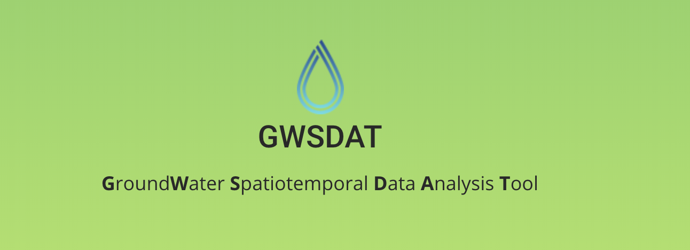

```{r setup, include = FALSE}
library(knitr)
library(magrittr)
library(kableExtra)
opts_chunk$set(echo = FALSE, fig.align = 'center', out.width = '60%')
```

\newpage
```{r}

```

\newpage
```{r child = '[01] acknowledgements.Rmd'}
```

\newpage
```{r child = 'introduction.Rmd'}
```

\newpage
```{r child = 'installation.Rmd'}
```

\newpage
```{r child = 'data-entry.Rmd'}
```

\newpage
```{r child = 'analysis.Rmd'}
```

\newpage
```{r child = 'reporting.Rmd'}
```

\newpage
```{r child = 'appendix_model.Rmd'}
```

\newpage

# References
