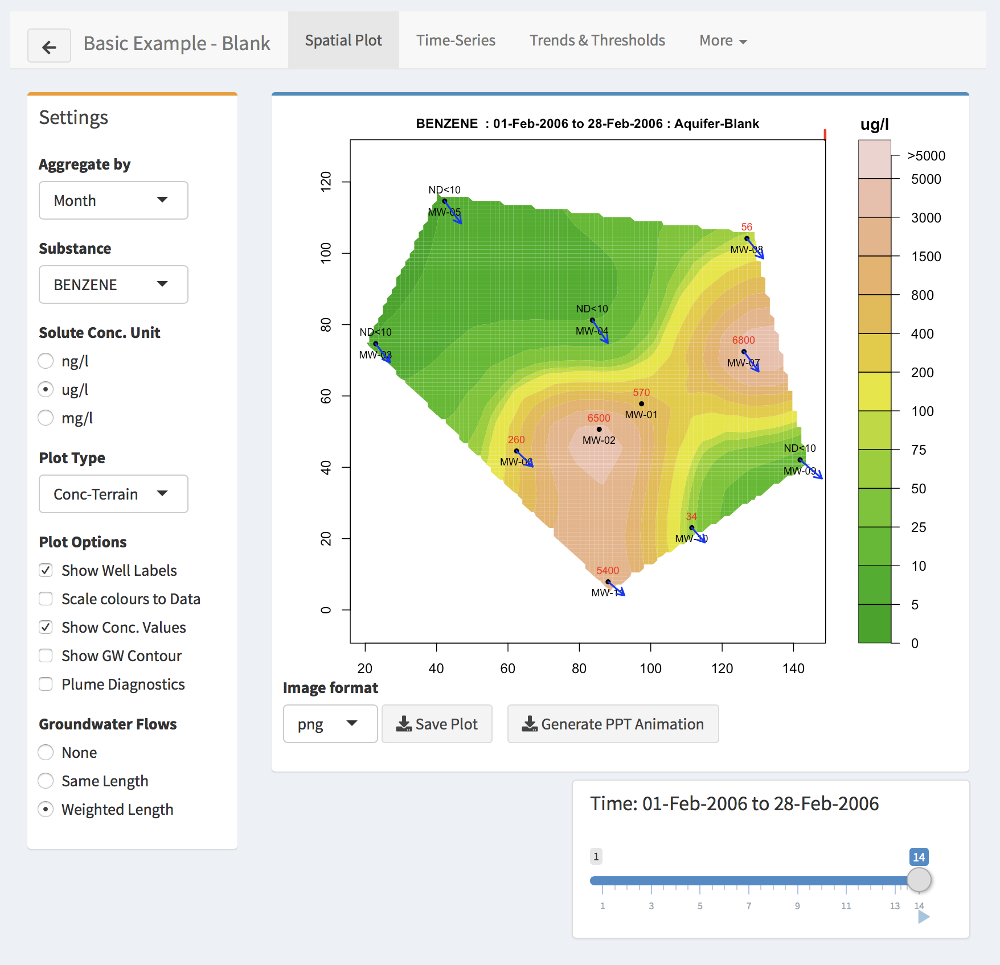

# Analysing the data

<!-- \label{sec:analysis} -->

GWSDAT is designed to produce informative visualisations of groundwater monitoring over space and time.  To illustrate this, we will use the *Basic Example*.  If you are still in the detailed pages of the *Manage Data* section, click on the `back-arrow' in the top left hand corner to return to the main \textit{manage Data} page and then click on *Analyse* on the left had sidebar.  You will then be asked to specify which dataset you would like to analyse.  In addition to the standard examples, any other datasets you have created will be listed here too.  For the moment, click on the *Select* button for the *Basic Example'*.  You should now see a screen similar to the image below.

```{r echo = FALSE}

```

The tabs at the top of this page give access to several different forms of analysis.  These are described in detail below.


## Spatial plot

A key feature of GWSDAT is the ability to produce estimates of contaminant concentrations over space and time simultaneously.  This gives a more effective method of analysis than the examination of concentration maps at isolated time points, or of time trends at isolated locations.  The simultaneous use of information over space and time allows estimates at particular locations and times to 'borrow strength' from neighbouring data.  Use the slider at the foot of the page to explore how the estimates of Benzene concentration change across the month of October.  Note that the slider box at the foot of the page can be moved to any convenient position by clicking and dragging with the mouse.  The 'Play' symbol (forward-arrow) in the bottom right hand corner of the slider activates a 'movie', which can be paused by pressing the button again.

The *Settings* box gives control over many aspects of the display.

* **Aggregate by** provides a drop-down menu which allows the temporal resolution to be altered (Day, Month, Quarter, Year).  This gives different perspectives on the trends present in the data.  Of course, the highest resolution (here, day) will be constrained by the frequency of data collection.

* **Substance** allows different contaminants to be inspected, if these have been recorded in the dataset.  Use the drop-down menu to select this.

* **Solute Conc. Unit** allows the units to be changed.

* **Plot Type** allows the contour colours to be changed or the display to be focussed on the wells through the size and colour of plotted circels.

* **Plot Options** gives control over a variety if different annotations which add detailed information to the map.

* **Groundwater Flows** gives control over the display of this information.


## Time Series

## Trends \& Thresholds

## More
