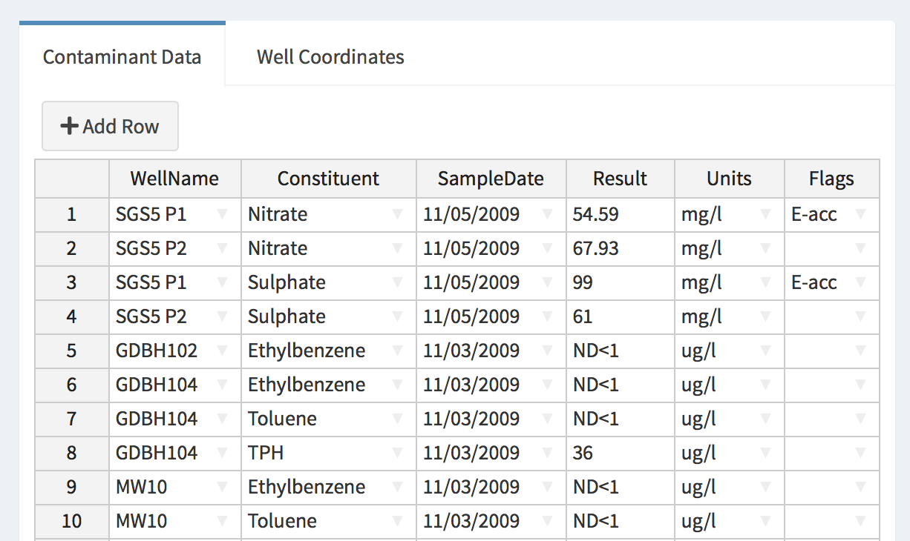

# Using your own data

GWSDAT comes supplied with examples of groundwater monitoring data and these can be used to experiment with the tools for analysis and visualisation.  If you would like to do this you can move immediately to Section~X of this manual.  However, the aim of GWSDAT is of course to provide means of analysing user-supplied data and various options are supplied to allow this.  These options are all available from the *Manage Data* page which is the point of entry when GWSDAT is launched but can also be accessed at any time from the *Manage Data* item on the menu bar on the left hand side of the window.

```{r echo = FALSE}
    include_graphics("figures/data_manager.png", auto_pdf = FALSE)
```

A *Basic Example* and a *Comprehensive Example* are supplied but the buttons at the top of the page allow other data to be entered, in different forms.

```{r eho = FALSE}
tbl <- matrix(c("Restore Examples", "This allows the two in-built examples to be restored at any point, should this be needed.",
                "Load Data", "Use the *Browse* button to	loaded from a previous GWSDAT session.",
                "Add New Data", "This allows data to be entered manually into a spreadsheet (and saved for later use).",
                "Import .csv Data", "Use the *Browse* buttons to load separate 'Contaminant Data' and 'Well Coordinates' files, each in `.csv` form.  One or more shapefiles may also be loaded.",
                "Import Excel File", "Use the *Browse* button to load an Excel spreadsheet containing both 'Contaminant Data' and 'Well Coordinates'. One or more shapefiles may also be loaded."
                ), ncol = 2, byrow = TRUE)
kable(tbl) %>%
  column_spec(2, width = "30em")
```

<!-- \begin{tabular}{rm{0.7\textwidth}} -->
<!-- \cline{2-2} -->
<!-- \colorbox{NavyBlue}{\color{white} \textsf{Restore Examples}} & -->
<!-- This allows the two in-built examples to be restored at any point, should this be needed.  \\ -->
<!-- \cline{2-2} -->
<!-- \colorbox{NavyBlue}{\color{white} \textsf{Load Data}} & -->
<!-- Use the \textit{Browse} button to	loaded from a previous GWSDAT session. \\ -->
<!-- \cline{2-2} -->
<!-- \colorbox{NavyBlue}{\color{white} \textsf{Add New Data}} & -->
<!-- This allows data to be entered manually into a spreadsheet (and saved for later use).  \\ -->
<!-- \cline{2-2} -->
<!-- \colorbox{NavyBlue}{\color{white} \textsf{Import .csv Data}} & -->
<!-- Use the \textit{Browse} buttons to load separate 'Contaminant Data' and 'Well Coordinates' files, each in \texttt{.csv} form.  One or more shapefiles may also be loaded. \\ -->
<!-- \cline{2-2} -->
<!-- \colorbox{NavyBlue}{\color{white} \textsf{Import Excel File}} & -->
<!-- Use the \textit{Browse} button to load an Excel spreadsheet containing both 'Contaminant Data' and 'Well Coordinates. One or more shapefiles may also be loaded. \\ -->
<!-- \cline{2-2} -->
<!-- \end{tabular} -->

The details of data entry are described below but it is helpful first to describe the format of the data which is required.  The essential information is in are two spreadsheets - one which contains the contaminant data, and a second one which gives the co-ordinates of the wells.  There is also an option to use shape files to superimpose map information on spatial plots.

An example of the first spreadsheet is shown for the *Basic Example* in the screenshot below.  The full spreadsheet can be viewed by clicking the *Edit* button for the *Basic Example* in the *Manage Data* page of GWSDAT.  (When you wish to return to the *Manage Data* page, click the `back-arrow' button in the top left hand corner of the *Edit Data* page.)  The columns of the spreadsheet are explained in detail below.

\fbox{Wayne advises against the use of the term 'contaminant' but this is the terminology used in the software.}

## Well Data

```{r cho = FALSE}

```

Each row of this table gives the details of a particular measurement.  There should be no empty rows in the table.

* **WellName**: the name or identifier of the well (or soil boring) from which the sample was collected. Well names must be consistent and unique. For example, `MW-1' and `MW1' will be treated as different wells.

* **Constituent**: the name of the solute, for example `Benzene` or `Toluene`. The name of a solute must be consistent and unique.  The name `GW` is reserved for measurements of groundwater level and `NAPL` is reserved for NAPL thickness data.  There are further details on this below.

* **SampleDate**: the date at which the well was sampled (not the date the results were returned from laboratory analysis). 
Please use a calendar date format, the preferred format is `dd/mm/yyyy`. Do not include a time of day. 

* **Result**: the value of the measurement made. This will be a solute concentration, a groundwater level or a NAPL thickness, as specified in the *Constituent* column.

For solute concentrations, non-detect values should be entered as either `<X` or `ND<X`, where `X` is the detection limit specified by the laboratory. For example, if the detection limit is $100\mu g/l$ then either `<100` or `ND<100` is acceptable. The non-detect threshold value must be specified so `ND` on its own is not permissible. In the absence of known detection limits, a sensible value must be substituted.  This could be the lowest measured value for the solute in the dataset.   

Groundwater level data is entered as an elevation above a common datum, such as metres or feet above sea level or some other common reference height. All groundwater measurement entries should have the same units, such as metres or feet, and the `Constituent~ field should be set to `GW`. In the presence of NAPL, please ensure that the groundwater level has been corrected for NAPL density.

For NAPL thickness data, all entries should have the same units, such as feet or metres, and the `Constituent' field should be set to `NAPL`.  If no NAPL is present, do not add a NAPL entry with zero thickness -- simply do not add an entry.

Where NAPL is recorded in soil borings that do not reach the water table, the NAPL thickness should be entered as zero.  
Well location markers for soil borings or wells where NAPL has been recorded are  highlighted in red.

* **Units**: the units of the *Result*.This must be specified for each entry, with consistent units for each type of *Constituent*. Solute concentration data can either be `mg/l` or $\mu$`g/l`. Groundwater level and NAPL thickness data should be set to one of `mm`, `cm`, `metres`, `inches`, `feet` or `level`.

* **Flags**: these are available to modify the way in which certain types of data are handled by the software. The `E-Acc` (Electron Acceptor), `NotInNAPL` and `Redox` flags are used to identify results which are to be omitted in the event that the user activates the NAPL substitution function; see the Section on NAPL handling. Note that it is only necessary to flag one data row in this way for all rows containing that constituent to be excluded from NAPL. The `Omit` flag can be used to exclude any individual data row from the analysis. 


## Well co-ordinates

<!-- \label{sec:well-coords} -->

```{r echo = FALSE}
include_graphics("figures/data-format-2.png")
```

An example of a *WellCoordinates* table is shown above.  This can be viewed by clicking on the *Well Coordinates* tab in the *Edit Data* page for the *Basic Example*.  This table is used to store the co-ordinates of the groundwater monitoring wells or soil borings. This information is essential for spatial and spatiotemporal analyses. For most of the purposes of GWSDAT modelling, it is only the relative distances between wells which are important.  This means any arbitrary cartesian co-ordinate system can be used as long as well co-ordinate values have an aspect ratio very close to 1 -- in other words, a unit in the x-coordinate corresponds to the same distance as a unit in the y-coordinate. Hence, well co-ordinates can be measured directly from a map, or given in easting and northing, etc. 

The columns of the spreadsheet are described below.  There should be no empty rows in the table.

* **WellName**: the name or identifier of the well or soil boring. Well names must be identical to those specified in the *Contaminant Data* table. On a point of detail, it is better to name wells using the convention of `MW-01` rather than `MW1` so that plots in GWSDAT are correctly ordered. 

* **XCoord**: the x-coordinate of the well.

* **YCoord**: the y-coordinate of the well.

* **Aquifer**: an optional column which allows wells or soil borings to be associated with particular subsurface features such as aquifers or sub-strata, in case these data need to be modelled separately. The name (maximum of 8 characters) of the aquifer or sub-stratum can be entered or a letter (A--G) can be used.  The aquifer field can also be used to partition the dataset from a large site, in the event that multiple unrelated plumes are present or wells are grouped into well separated clusters. When analysis begins, the user is asked to select an aquifer (subsurface feature) to analyse. Plots generated using data associated with particular subsurface features have the feature name appended to the title. 

Notice the *Coordinate Unit* button in the box to the left of the spreadsheet.  This enables the spatial units to be specified as metres or feet, through a drop-down menu.


## Shape Files

<!-- \label{sec:shapefiles} -->

A further possible component of the data is a site map in the form of a *shape file*.  This is optional but can be very useful in superimposing map information on spatial plots.  Examples will be given later in the manual.

\fbox{The paragraphs below need to be updated.}

A 'shapefile' is actually a collection of several files, typically created using ARC-GIS.^[See `http://en.wikipedia.org/wiki/Shapefile` for more information on this format.]  The *Shape Files* table consists of a single column where each entry is the name of a file (including its path) containing site plans.  These must be in shapefile format. Filenames can be entered manually or, in interactive mode, the `Browse ...' can be used. Only the location of the main shapefile (file ending with a `.shp' extension) needs to be specified in this table - the associated data files (such as `.dbf`, `.sbn`, `.sbx`, `.shx`) will be picked up automatically, but they must be in the same folder. An example is given in the Figure below. 

It is possible to overlay multiple shapefiles up to a maximum of seven.  There should be no empty rows in the table.


## Entering your own data

<!-- \label{sec:entering-data} -->

The various ways in which data can be entered are described below.  The easiest option is likely to be to create the spreadsheets in a format you are familiar with, such as *Excel*, and then load the files into GWSDAT.

```{r echo = FALSE}
tbl <- matrix(c("Import Excel File", "The file to be loaded should contain two spreadsheets labelled `Contaminant Data` and `Well Coordinates` and have the structure described above.  An example spreadsheet is available at *web address at gwsdat.net*.",
              "Import .csv Data", "The data can be exported from *Excel() into `.csv` format.  In this case there should be separate `.csv` files for the *Contaminant Data* and *Well Coordinates*.  Click on the *Browse* button to select these files.  For convenience, GWSDAT gives options for the *Column separator* and the *Quote for Character Strings* at the foot of this page. Click on the *Import|* button to read the data.",
              "Add New Data", "This creates blank spreadsheets with the required structure.  Entries can by typed in directly or copied and pasted from another source.  There is an *+Add Row* button and right clicking gives further options for adding and removing rows.",
              "Load Data", "This allows data which has previously been saved from GWSDAT to be loaded again."
              ), ncol = 2, byrow = TRUE)
kable(tbl) %>%
  column_spec(2, width = "30em")
```

<!-- \colorbox{NavyBlue}{\color{white} \textsf{Import Excel File}}  The file to be loaded should contain two spreadsheets labelled `Contaminant Data' and `Well Coordinates' and have the structure described above.  An example spreadsheet is available at \fbox{web address at gwsdat.net}. -->

<!-- \ -->

<!-- \noindent -->
<!-- \colorbox{NavyBlue}{\color{white} \textsf{Import .csv Data}}   The data can be exported from Excel into \texttt{.csv} format.  In this case there should be separate \texttt{.csv} files for the Contaminant Data and Well Coordinates.  Click on the `Browse' buttons to select these files.  For convenience, GWSDAT gives options for the `Column separator' and the `Quote for Character Strings' at the foot of this page. Click on the `Import' button to lead the data. -->

<!-- \ -->

<!-- \noindent -->
<!-- \colorbox{NavyBlue}{\color{white} \textsf{Add New Data}}  This creates blank spreadsheets with the required structure.  Entries can by typed in directly or copied and pasted from another source.  There is an \textit{+Add Row} button and right clicking gives further options for adding and removing rows. -->

<!-- \ -->

<!-- \noindent -->
<!-- \colorbox{NavyBlue}{\color{white} \textsf{Load Data}}  \fbox{Is this option available - I can't see a Save option?} -->

